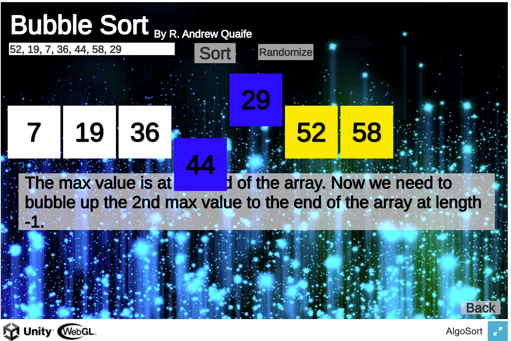

# Quadratic Sorting Algorithm Game
### [Learn & Play NOW! CLICK HERE](https://simmer.io/@supracharger/quadratic-sorts): Play on the Web

## Description:

The game displays explanation animation on the Quadratic Sorting Algorithms: Bubble Sort, Insertion Sort, and Selection Sort. So, one can better understand the sorting algorithms. You can sort your own numbers if you want, or ‘Randomize’ the numbers works too. Just hit the ‘Sort’ button to sort the numbers and see the animations and explanations. You can play on the web without downloading anything just hit the link above.

